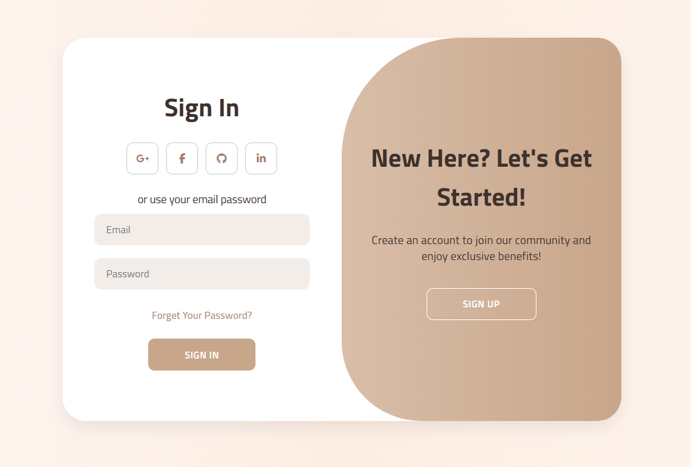
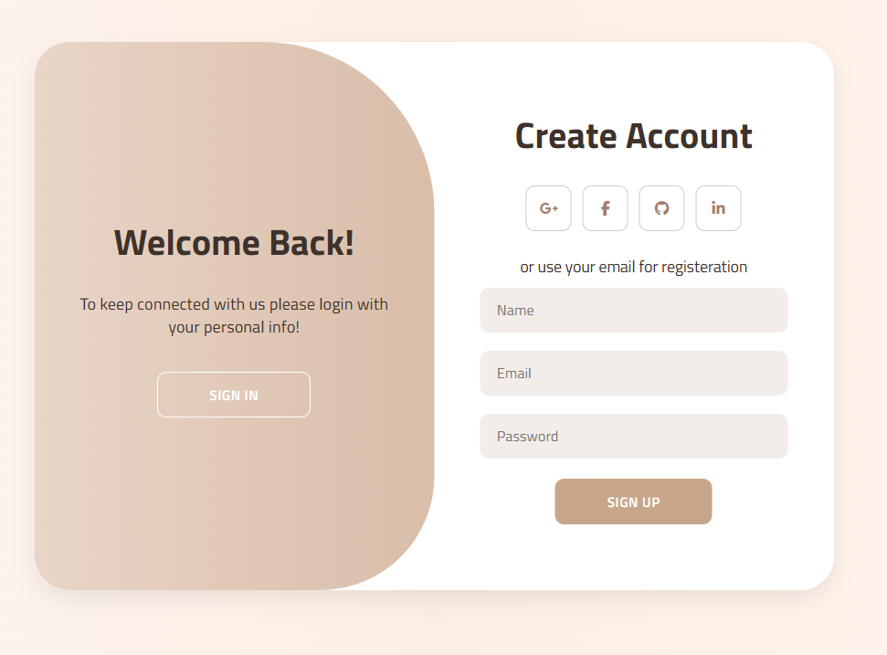

# User Authentication UI - Responsive Login & Sign Up Form ✨🔐

This project provides a modern and elegant user interface for easy user registration and login.

## Preview 📸 
  

## Features ⭐

- **Responsive Design** 📱: Adapts seamlessly to different screen sizes.  
- **Toggle System** 🔄: Smooth transition between login and sign-up forms.  
- **Pastel Color Palette** 🎨: Soft, eye-friendly colors that create a warm atmosphere.  
- **Google Fonts** ✍️: Uses the sleek *Titillium Web* font.  
- **Social Media Icons** 🌐: Placeholders for Google, Facebook, GitHub, and LinkedIn.  
- **Modern CSS Techniques** : Includes border-radius, box-shadow, transitions, and animations.

## Technologies Used 🛠️

- HTML5  
- CSS3 (Flexbox, Transitions, Animations)  
- Font Awesome (for icons)  
- Google Fonts (Titillium Web)  

## Installation 🚀

1. Download or clone the repository.  
2. Open `index.html` in your favorite web browser.  
3. Use `script.js` to add button functionality.

## License 📄

This project is licensed under the MIT License.
